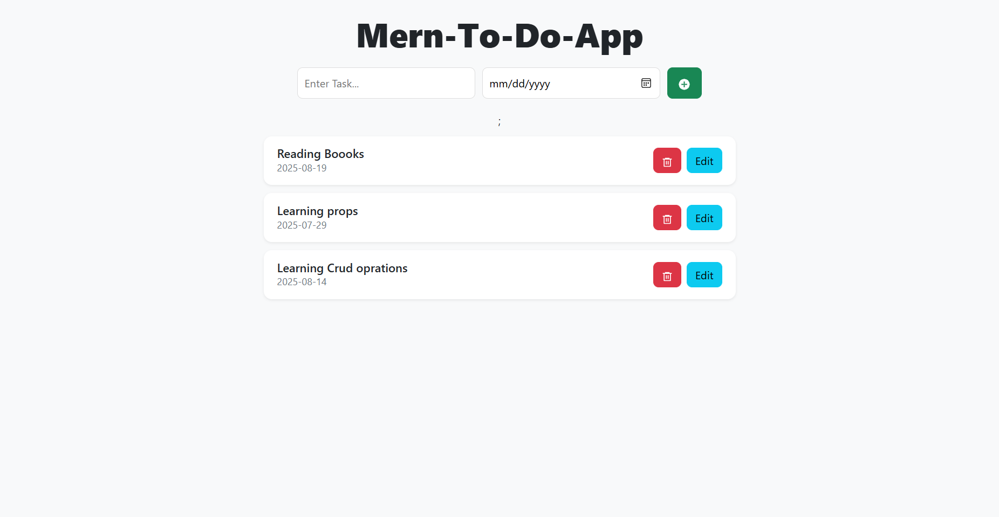

MERN To-Do App

A simple To-Do application built with the MERN stack (MongoDB, Express, React, Node.js).
Features CRUD operations, Bootstrap modal for editing, and REST API integration.

🚀 Features

✅ Add new tasks with due dates

✏️ Edit existing tasks using a modal

❌ Delete tasks

📜 Fetch tasks from MongoDB

🔄 Real-time UI updates without refresh
🛠 Tech Stack

Frontend: React, Bootstrap

Backend: Node.js, Express.js

Database: MongoDB (Mongoose)

API: RESTful endpoints

📂 Project Structure
mern-todo-app/
│
├── backend/
│ ├── server.js
│ ├── models/
│ └── routes/
│
├── frontend/
│ ├── src/
│ └── public/
│
└── README.md
⚙️ Installation & Setup
1️⃣ Clone the repository
git clone https://github.com/YOUR-USERNAME/mern-todo-app.git
cd mern-todo-app
2️⃣ Backend Setup
cd backend
npm install

# Create .env file

MONGO_URI=your-mongodb-connection-string
PORT=3000
npm start
3️⃣ Frontend Setup
cd frontend
npm install
npm run dev
📡 API Endpoints
| Method | Endpoint | Description |
| ------ | ------------ | --------------- |
| GET | `/todos/get` | Fetch all todos |
| POST | `/todos` | Add a new todo |
| PUT | `/todos/:id` | Update a todo |
| DELETE | `/todos/:id` | Delete a todo |
🖼 Screenshots

## 📸 Screenshot

📜 License

This project is licensed under the MIT License.
