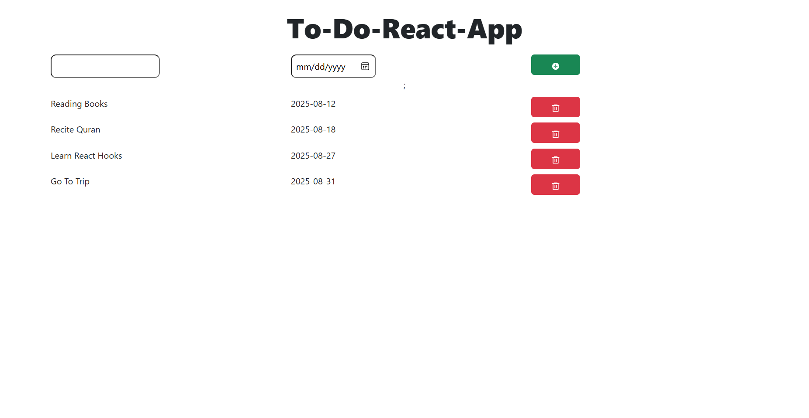

# React To-Do App ✅

A simple and responsive **To-Do App** built using React.  
This app allows users to:

- ✅ Add tasks with a **name** and **due date**
- ✅ Remove tasks
- ✅ View a clean and minimal UI for managing tasks

---

## 🚀 Features

- Add new tasks with **task name** and **date**
- Delete tasks from the list
- Responsive and user-friendly design

---

## 🛠️ Tech Stack

- **React JS** (Frontend)
- **CSS Modules** for styling
- **Vite** for fast build

---

## 📸 Screenshot



---

## ▶️ How to Run Locally

1. Clone the repository:
   ```bash
   git clone https://github.com/your-username/react-todo-app.git
   ```
